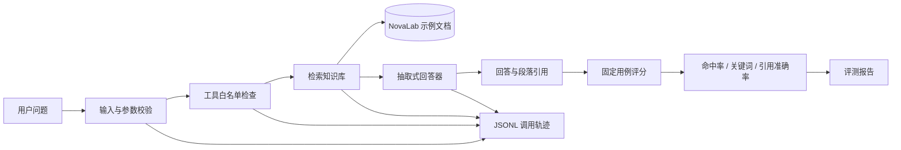

# RAG Agent Harness

一个可以在本地完整复现的 **RAG Agent 测试台**：它让 Agent 检索知识库、生成带来源的回答，并自动检查 Agent 是否找对证据、引用是否准确、失败发生在哪一步。

> 这不是一个追求“回答看起来很聪明”的聊天 Demo。它关注的是：Agent 能不能被测试、被诊断、被安全地迭代。

项目仅使用 Python 标准库，不需要 API Key、外部大模型、向量数据库或网络服务。Python 要求为 3.10 及以上。

## 它解决什么问题

普通 RAG Demo 往往只能展示一次成功回答，但在工程中还需要回答下面的问题：

1. Agent 找到的是正确证据，还是碰巧生成了正确文字？
2. 回答中的引用真的支持结论吗？
3. 失败发生在输入、工具、检索、超时还是回答阶段？
4. 修改检索逻辑或 Prompt 后，同一批问题是否真的变好？
5. Agent 是否会调用未授权工具，或者在没有证据时编造答案？

这个 Harness 为这些问题提供固定用例、自动指标、JSONL 调用轨迹、失败分类和自动测试。

## 使用了什么例子

仓库内置了一个完全虚构的公司 **NovaLab**，并提供 5 份脱敏知识库文档：

| 文档 | 内容示例 |
|---|---|
| `incident_response.md` | P0 事故响应时间、复盘期限、生产写入限制 |
| `release_policy.md` | 发布时间窗口、必需测试和回滚演练 |
| `security_policy.md` | 工具白名单、人工确认、日志字段和密钥保护 |
| `api_limits.md` | 模型网关限流、Token、延迟和费用记录 |
| `knowledge_workflow.md` | 文档入库、引用、无结果处理和索引更新 |

`eval_cases.json` 中有 10 条固定问题。每条问题在运行前就定义了：

- `expected_sources`：正确答案应该来自哪些文档；
- `keywords`：回答中应该出现哪些关键信息。

例如：

```json
{
  "id": "case_01",
  "question": "P0 生产事故要求多久首次响应？",
  "expected_sources": ["incident_response.md"],
  "keywords": ["5 分钟", "首次响应"]
}
```

知识库原文明确写着 P0 事故必须在 5 分钟内首次响应。Harness 应该检索到对应段落，返回回答，并附上类似 `incident_response.md#p2` 的引用。

## 一次请求具体发生了什么



以“P0 生产事故要求多久首次响应？”为例：

1. 校验问题不为空，并检查 `top_k` 是否在 1–5 之间。
2. Harness 只允许调用 `search_docs`，其他工具名称直接拒绝。
3. 检索器读取 Markdown/TXT，把文档按段落切分。
4. 中文使用相邻双字词、英文使用单词进行确定性打分。
5. 取得分最高的证据段落，抽取原文形成回答。
6. 返回回答、段落引用、证据内容、延迟和近似 Token。
7. 用预期来源和关键词自动评分，同时写入 JSONL 调用轨迹。

这里故意使用确定性本地检索和抽取式回答器：同一份代码和数据可以重复得到相同语义结果，适合作为接入真实 LLM 前的可复现基线。

## 五分钟验证

### 1. 克隆仓库

```bash
git clone https://github.com/Bowen-studying/rag-agent-harness.git
cd rag-agent-harness
python --version
```

如果 Windows 找不到 `python`，可将下面命令中的 `python` 换为 `py -3`。

### 2. 运行 8 项自动测试

```bash
python -m unittest discover -s tests -v
```

预期结尾：

```text
Ran 8 tests
OK
```

测试覆盖：正确检索、明确无结果、非法参数、越权工具、超时、完整轨迹、Checkpoint 续跑和 10 条评测用例。

### 3. 运行 10 条固定评测

```bash
python -m rag_harness.cli eval --cases eval_cases.json --docs sample_docs --output artifacts/eval_report.local.json --trace-dir artifacts/traces
```

当前参考结果：

```json
{
  "case_count": 10,
  "success_rate": 1.0,
  "retrieval_hit_rate": 1.0,
  "keyword_pass_rate": 1.0,
  "citation_accuracy": 0.9,
  "p50_latency_ms": 2.032,
  "approx_input_tokens": 1019,
  "approx_output_tokens": 873,
  "estimated_cost_usd": 0.0
}
```

`p50_latency_ms` 会随电脑性能变化，不要求与参考值完全相同。

### 4. 单独询问一个问题

```bash
python -m rag_harness.cli ask "P0 生产事故要求多久首次响应？" --docs sample_docs --trace artifacts/traces/demo.jsonl
```

回答中应出现“5 分钟”“首次响应”，并包含 `incident_response.md#...` 引用。

### 5. 查看逐步调用轨迹

PowerShell：

```powershell
Get-Content artifacts/traces/demo.jsonl -Encoding UTF8
```

macOS/Linux：

```bash
cat artifacts/traces/demo.jsonl
```

正常轨迹包含：

```text
run_started
tool_started
tool_completed
answer_completed
run_completed
```

每条记录包含运行 ID、工具名、候选来源、引用、延迟或失败类型，可用于定位一次 Agent 调用究竟发生了什么。

### 6. 验证没有证据时不会编造

```bash
python -m rag_harness.cli ask "火星基地的午餐菜单是什么？" --docs sample_docs
```

预期结果：

```json
{
  "success": false,
  "failure_reason": "no_result"
}
```

命令返回非零退出码是预期行为，表示 Harness 正确识别了失败，而不是编造答案。

## 指标是怎样计算的

| 指标 | 计算方式 | 它回答的问题 |
|---|---|---|
| `success_rate` | 成功完成流程的用例比例 | Agent 能否正常完成任务 |
| `retrieval_hit_rate` | 引用来源与预期来源至少有一个交集的比例 | 是否找到了正确文档 |
| `keyword_pass_rate` | 命中至少 50% 预期关键词的用例比例 | 回答是否覆盖关键信息 |
| `citation_accuracy` | 每题“正确引用来源数 / 全部引用来源数”的平均值 | 引用是否夹杂无关来源 |
| `p50_latency_ms` | 所有用例延迟的中位数 | 本地流程的典型耗时 |
| Token / 费用 | 当前为近似计数和可配置价格公式 | 接入真实模型后比较成本 |

当前检索命中率为 100%，但引用准确率为 90%。原因是 `case_03` 和 `case_07` 在引用正确文档的同时，各带入了一个额外来源。这是一个被报告真实暴露出来的问题，后续可通过重排、相关性阈值和困难负样本改进。

## 安全与可靠性设计

- **工具白名单**：只允许 `search_docs`；例如 `delete_database` 会被标记为 `tool_boundary`。
- **参数约束**：问题不能为空，`top_k` 只能在 1–5 之间。
- **无结果保护**：没有相关证据时返回 `no_result`，不让回答器凭空生成来源。
- **超时分类**：工具调用前后都检查超时，并写入 `run_failed`。
- **Checkpoint 续跑**：用问题和参数的哈希定位已有结果，支持中断后复用。
- **轨迹脱敏原则**：Checkpoint 和日志不应保存 API Key、访问令牌或隐私原文。

## 项目结构

```text
rag_harness/
  agent.py          Agent流程、工具边界、超时和Checkpoint
  retrieval.py      文档分段、索引和确定性检索
  evaluation.py     10条用例执行与指标计算
  trace.py          JSONL事件轨迹
  cli.py            ask/eval命令行入口
sample_docs/         NovaLab虚构知识库
tests/               8项自动测试
eval_cases.json      固定问题、预期来源和关键词
artifacts/
  eval_report.json   已提交的参考评测报告
```

## 怎样接入真实系统

当前版本是最小可复现基线，不是生产 RAG 服务。真实项目中可以逐层替换：

| 当前实现 | 可替换为 |
|---|---|
| 本地 Markdown/TXT | Trove、企业知识库、对象存储 |
| 确定性关键词检索 | Qdrant、Milvus、Elasticsearch、混合检索 |
| 抽取式回答器 | OpenAI-compatible LLM 或私有模型 |
| 本地 JSONL | LangFuse、OpenTelemetry、集中日志平台 |
| 固定关键词评分 | LLM Judge、人工盲评、领域评分器 |

检索器、回答器和轨迹记录相互独立，因此替换实现后仍可复用同一批评测用例和报告结构。

## 当前边界

- 结果来自虚构 NovaLab 文档，不能代表真实企业知识库效果。
- 当前没有调用外部 LLM，`estimated_cost_usd` 为 0。
- 当前延迟主要是本地检索耗时，不能等同于真实模型接口延迟。
- Token 是近似估算，不是某个模型官方 tokenizer 的精确结果。
- 10 条用例用于展示评测闭环，生产环境需要更大规模的盲测集、困难负样本和人工复核。

## License

MIT
