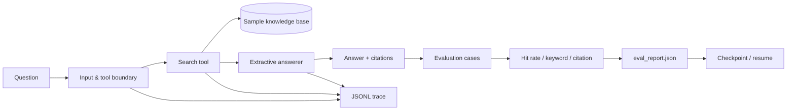

# RAG Agent Harness

一个可在本地复现的 RAG Agent 评测样例：检索知识库、生成带引用回答，并自动记录正确性、延迟、Token/费用估算、失败原因和逐步调用轨迹。

它解决的不是“做一个能回答问题的 Demo”，而是回答三个工程问题：

1. Agent 这次是否找到了正确证据？
2. 失败发生在参数、工具、检索、超时还是回答阶段？
3. 同一批用例修改后，效果、延迟和成本是否真的改善？

## 五分钟运行

```bash
python -m unittest discover -s tests -v
python -m rag_harness.cli eval --cases eval_cases.json --docs sample_docs --output artifacts/eval_report.json
python -m rag_harness.cli ask "生产事故的首次响应时间要求是什么？" --docs sample_docs --trace artifacts/traces/demo.jsonl
```

项目不依赖外部模型或向量数据库，默认使用可重复的本地检索和抽取式回答器。`estimated_cost_usd` 因此为 0，但报告仍保留 Token/价格接口，接入 OpenAI-compatible 模型后可使用同一评测结构。

## 架构



## 可观测性

每次运行写入 JSONL 事件：

- `run_started`：问题、参数和 run id
- `tool_started/tool_completed`：工具名、候选数量、证据来源
- `answer_completed`：引用、近似输入/输出 Token
- `run_completed/run_failed`：延迟、费用和失败类型
- `checkpoint_hit`：断点续跑命中

示例结果位于 `artifacts/eval_report.json`，固定 10 条用例。默认报告包括：

- `retrieval_hit_rate`
- `keyword_pass_rate`
- `citation_accuracy`
- `success_rate`
- `p50_latency_ms`
- `approx_input_tokens` / `approx_output_tokens`
- `estimated_cost_usd`

## 安全边界

- 只允许调用 `search_docs` 工具；其他工具名直接拒绝。
- `top_k` 限制在 1-5，问题不能为空。
- 超时在工具执行前后检查并记录为 `timeout`。
- 检索不到证据时返回明确失败原因，不让回答器编造来源。
- Checkpoint 只保存脱敏后的输入摘要和结果，不保存密钥。

## 目录

```text
rag_harness/          核心检索、Agent、评测与 CLI
sample_docs/          虚构公司 NovaLab 的示例知识库
tests/                边界、超时、评测与续跑测试
eval_cases.json       10 条固定评测用例
artifacts/            示例报告及运行产物
```

## 与真实系统的连接点

`DocumentIndex`、`Answerer` 和 `TraceWriter` 都是独立接口。实际项目可分别替换为 Trove/Qdrant、LLM API 和 LangFuse/OTel，而无需改变评测用例与报告格式。

