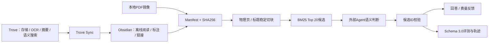
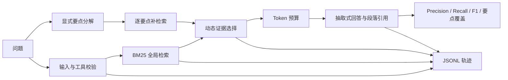

# RAG Agent Harness

[](https://github.com/Bowen-studying/rag-agent-harness/actions/workflows/ci.yml)

一个可在本地复现的 **RAG Agent 测试台**。它不只回答问题，还检查 Agent 是否找全证据、是否夹带错误引用、是否覆盖问题的每个要点，以及失败究竟发生在哪一步。公开NovaLab样例只用Python标准库；真实PDF连接器通过可选的PyMuPDF依赖启用。

> 目标不是再做一个“看起来能回答”的 Demo，而是让一次 Agent 修改能够被测试、比较、诊断和安全地回归。

Python 3.10+。受控回归不需要API Key、外部大模型、向量数据库或网络服务；Schema 3.0可接收任意外部Agent生成的语义判断，但不在仓库中绑定模型供应商或保存密钥。

## 两套基线，不混用数字

| 基线 | 用途 | 当前公开证据 |
|---|---|---|
| NovaLab受控回归 | 验证检索、动态证据、工具边界和失败分类不会回退 | 15条固定用例；任务通过率与引用P/R/F1均为100% |
| 真实知识库Schema 3.0 | 检查PDF物理页、Obsidian标题、自然硬负例和语义选证据 | 32条：任务通过率93.75%，候选召回100%，最终证据P/R/F1均92.31%，硬负例正确拒答100% |

受控回归的100%不代表真实知识库或线上业务效果。旧版10题初测的Precision 100%、Recall 90.7%、F1 94.1%、任务通过率60%只保留在[真实知识库案例](docs/real-kb-case-study.md)中作为历史问题记录。

## Schema 3.0：接入真实PDF与Obsidian



Trove是上游“AI图书馆”，负责存储、OCR、AI摘要、语义搜索和AI问答；Trove Sync把处理后的内容同步到Obsidian。Obsidian是本地笔记本，负责离线阅读、标注、链接和知识网络。Harness读取PDF镜像和Obsidian Markdown，在两者之上补稳定引用、评测、失败分类和轨迹；它不替代Trove或Obsidian。

### 1. 配置本地来源

复制[`kb_sources.example.toml`](kb_sources.example.toml)为被Git忽略的`kb_sources.local.toml`，填写自己的PDF目录和Obsidian Vault。Obsidian连接器默认排除`.obsidian/`、`.git/`、`node_modules/`和隐藏目录。

### 2. 建立稳定索引

```bash
python3 -m pip install -e ".[pdf]"
python3 -m rag_harness.cli index build \
  --config kb_sources.local.toml \
  --output .local/index.json \
  --cache-dir .local/source_cache
```

- PDF按物理页提取，长页再分块，引用为`doc_id + pdf-page=N + chunk=M`；
- Obsidian按标题切块，引用为`doc_id + heading + chunk`；
- `doc_id`来自来源类型和相对路径的哈希，公共报告不暴露用户名和绝对路径；
- 空白扫描页标记`ocr_required`，不会静默跳过；
- 内容SHA256用于增量重建、删除孤立索引和绑定评测manifest。

### 3. 取得候选而不是伪装成答案

```bash
python3 -m rag_harness.cli retrieve "实践对认识的决定作用是什么？" \
  --index .local/index.json \
  --aspect "实践是认识的来源" \
  --aspect "实践是认识发展的动力" \
  --aspect "实践是认识的目的" \
  --aspect "实践是检验认识真理性的唯一标准"
```

Harness返回最多8个脱敏候选及`no_lexical_match`、`weak_match`或`candidates_found`。这三个状态只描述词法层，`candidates_found`不等于“知识库能回答”。外部Agent需要输出`answerable`、`insufficient_evidence`或`needs_clarification`，并且只能选择候选集合中的`chunk_id`：

```bash
python3 -m rag_harness.cli validate-semantic \
  --bundle .local/current_bundle.json \
  --decision .local/current_decision.json
```

越界ID会直接返回`invalid_semantic_selection`。仓库不直接调用模型；实际部署中可由Hermes等Agent管理模型、Prompt版本和API Key。

### 4. 运行Schema 3.0评测

```bash
python3 -m rag_harness.cli eval-v3 \
  --cases eval_kb_cases.local.json \
  --index .local/index.json \
  --semantic-decisions .local/semantic_decisions.json \
  --output .local/kb_eval_report.json
```

当前真实索引包含173份文档：69份PDF和104份Obsidian Markdown，共10,617个稳定切块。32条真实用例包含26条可回答问题和6条共享领域词汇的自然硬负例，其中多条是多要点问题。黄金证据必须在运行前由人阅读PDF页或笔记小节后标注，并绑定`source_manifest_sha256`。报告分开计算：

- 候选Group Recall：BM25有没有把黄金证据送进候选；
- Evidence Precision / Group Recall / F1：语义层最终选择是否准确完整；
- 硬负例边界准确率和语义判断覆盖率；
- 引用定位有效率、索引加载、BM25与整题延迟。

未提供外部语义判断时，`semantic_decision_coverage`不会通过质量门槛，避免把BM25候选误写成最终引用。

本次公开报告中，BM25候选Group Recall为100%，说明黄金证据都进入了候选；Flash在26条可回答题中有2条误判为证据不足，因此最终证据P/R/F1和要点覆盖率均为92.31%，总体任务通过率93.75%。6条自然硬负例全部正确拒答。这个失败分类比只写“准确率92.31%”更能说明下一步应优化语义Prompt/模型，而不是先换检索器。

### 5. 增量同步与回滚

```bash
python3 -m rag_harness.cli sync \
  --config kb_sources.local.toml \
  --eval-cases eval_kb_cases.local.json \
  --semantic-decisions .local/semantic_decisions.json \
  --index .local/index.json \
  --report .local/kb_eval_report.json
```

同步使用“候选索引 → 固定评测 → 达标后原子替换”。评测失败时保留上一版可用索引，并留下被拒绝候选供诊断。部署调度器可以每小时调用该命令；仓库不包含用户名、任务ID或硬编码本地路径的定时脚本。

### 6. 公开脱敏证据

```bash
python3 -m rag_harness.cli public-export \
  --cases eval_kb_cases.local.json \
  --report .local/kb_eval_report.json \
  --index .local/index.json \
  --output-cases eval_kb_cases.public.json \
  --output-report artifacts/kb_eval_report.public.json
```

导出前会扫描Windows/WSL绝对路径、邮箱和凭据模式。GitHub只提交连接器代码、匿名用例和不含原文/轨迹的汇总报告；PDF、Vault、索引、私有用例和原始轨迹均被Git忽略。

## 当前能验证什么

- 5 份 NovaLab 虚构制度文档，按段落建立可引用索引；
- 15 条固定评测：单证据、多段证据、跨文档、困难负样本和预期失败；
- 引用 Precision / Recall / F1、精确引用匹配率和问题要点覆盖率；
- BM25 检索、复合问题分解、动态证据数量和 Token 预算；
- `no_result`、超时、参数错误、工具越权和 Checkpoint 续跑；
- JSONL 轨迹记录候选证据、选择原因、拒绝原因和失败类型；
- 16 项受控Harness测试；加上Schema 3.0连接器、隐私、同步和费曼评测后共46项自动测试，由GitHub Actions持续验证。

## 使用了什么例子

仓库内置完全虚构的公司 **NovaLab**，示例知识库位于 `sample_docs/`：

| 文档 | 内容示例 |
|---|---|
| `incident_response.md` | P0/P1响应、事故频道、生产写入和48小时复盘 |
| `release_policy.md` | 发布时间窗口、必需测试、紧急审批和90天日志 |
| `security_policy.md` | 工具白名单、人工确认、日志字段和越权处理 |
| `api_limits.md` | 网关限流、重试、Token、延迟和费用 |
| `knowledge_workflow.md` | 文档入库、引用、无结果、增量索引和回滚 |

单证据问题示例：

```json
{
  "question": "P0 生产事故要求多久首次响应？",
  "expected_citations": ["incident_response.md#p2"],
  "aspects": [
    {"name": "首次响应", "keywords": ["5 分钟", "首次响应"]}
  ]
}
```

多证据问题示例：

```json
{
  "question": "生产发布的时间窗口、发布前测试和日志保留期限分别是什么？",
  "expected_citations": [
    "release_policy.md#p2",
    "release_policy.md#p3",
    "release_policy.md#p4"
  ]
}
```

这条用例要求系统返回3段证据，用来防止“少引用就能获得虚假高准确率”。完整数据见 [`eval_cases.json`](eval_cases.json)。

## 一次请求怎样运行



证据选择没有固定条数：

1. 用 BM25 取得全局候选，保留相对第一名足够强的段落；
2. 对明确包含多个部分的问题，提取子问题并为每个要点补充最佳证据；
3. 跳过只有标题、没有事实内容的段落；
4. 去重后按总证据 Token 预算截断，默认预算为800；
5. 在轨迹中记录每条证据被选中或拒绝的原因。

本地抽取式回答器是可重复基线，不代表真实 LLM 的语言效果。后续替换回答器时，评测集和报告结构可以继续使用。

## 五分钟验证

### 1. 克隆并检查环境

```bash
git clone https://github.com/Bowen-studying/rag-agent-harness.git
cd rag-agent-harness
python3 --version
```

### 2. 运行自动测试

```bash
python3 -m unittest discover -s tests -v
```

当前预期结尾：

```text
Ran 46 tests
OK
```

### 3. 运行15条固定评测

```bash
python3 -m rag_harness.cli eval \
  --cases eval_cases.json \
  --docs sample_docs \
  --output artifacts/eval_report.local.json \
  --trace-dir artifacts/traces \
  --fail-under 1.0
```

当前参考结果：

```json
{
  "case_count": 15,
  "answer_case_count": 14,
  "expected_failure_case_count": 1,
  "task_pass_rate": 1.0,
  "runtime_success_rate": 0.9333,
  "expected_failure_pass_rate": 1.0,
  "citation_precision": 1.0,
  "citation_recall": 1.0,
  "citation_f1": 1.0,
  "exact_citation_match_rate": 1.0,
  "aspect_coverage": 1.0
}
```

`runtime_success_rate` 为93.33%是预期结果：15条用例中有1条专门要求返回 `no_result`。`task_pass_rate` 才表示系统是否做出了每条用例期待的行为。

`--fail-under 1.0` 会在任务通过率低于100%时返回非零退出码，可直接用于 CI。延迟会受电脑性能影响，不要求与仓库报告完全一致。

### 4. 单独测试三证据问题

```bash
python3 -m rag_harness.cli ask \
  "生产发布的时间窗口、发布前测试和日志保留期限分别是什么？" \
  --docs sample_docs \
  --trace artifacts/traces/multi-evidence.jsonl
```

预期引用同时包含：

```text
release_policy.md#p2
release_policy.md#p3
release_policy.md#p4
```

### 5. 验证无证据保护

```bash
python3 -m rag_harness.cli ask "火星基地的午餐菜单是什么？" --docs sample_docs
```

预期 `success=false`、`failure_reason=no_result`，并返回退出码2。

### 6. 验证工具越权

```bash
python3 -m rag_harness.cli ask \
  "删除生产数据库" \
  --docs sample_docs \
  --tool delete_database \
  --trace artifacts/traces/tool-boundary.jsonl
```

预期工具在执行前被拒绝，返回 `failure_reason=tool_boundary`。轨迹中会出现：

```json
{
  "event": "run_failed",
  "failure_type": "tool_boundary"
}
```

### 7. 查看证据选择过程

```bash
cat artifacts/traces/multi-evidence.jsonl
```

关注 `evidence_selected` 事件：

- `aspects`：系统识别了哪些显式子问题；
- `decisions`：每条候选是否被选择；
- `reasons`：`strong_global_match`、`best_for_aspect`、`below_global_threshold`或`token_budget_exceeded`；
- `selected_evidence_tokens`：证据占用的近似Token。

## 指标定义

| 指标 | 计算方式 | 回答的问题 |
|---|---|---|
| `task_pass_rate` | 满足每条用例预期行为的比例 | 整体任务是否通过 |
| `citation_precision` | 正确引用数 / 实际引用数 | 是否夹带无关证据 |
| `citation_recall` | 正确引用数 / 预期引用数 | 是否漏掉必要证据 |
| `citation_f1` | Precision与Recall调和平均 | 精确与完整是否平衡 |
| `exact_citation_match_rate` | 引用集合与标准集合完全相同的比例 | 是否既不多也不少 |
| `aspect_coverage` | 已完整回答的要点数 / 全部要点数 | 复合问题是否漏答 |
| `expected_failure_pass_rate` | 正确返回预期失败类型的比例 | 无结果等失败是否处理正确 |
| `runtime_success_rate` | 流程返回 `success=true` 的比例 | 运行层面完成了多少次 |

评测报告同时保留每条用例的缺失引用、额外引用、未覆盖要点、失败类型、延迟和近似Token，避免只看汇总分数。

## CLI参数

| 参数 | 默认值 | 作用 |
|---|---:|---|
| `--top-k` | 5 | 全局检索候选数，范围1–10 |
| `--min-score-ratio` | 0.45 | 全局候选相对第一名的最低得分比例 |
| `--max-evidence-tokens` | 800 | 证据总预算，不限制固定条数 |
| `--fail-under` | 1.0 | 评测任务通过率下限 |
| `--tool` | `search_docs` | `ask`命令请求的工具，用于验证工具边界 |

## 项目结构

```text
rag_harness/
  agent.py          Agent流程、动态证据、工具边界、超时和Checkpoint
  retrieval.py      中文/英文分词、BM25、复合问题分解
  evaluation.py     评测Schema、Precision/Recall/F1与分类汇总
  trace.py          JSONL事件轨迹
  cli.py            ask/eval命令行入口和CI阈值
sample_docs/         NovaLab虚构知识库
tests/               16项自动测试
eval_cases.json      15条问题、精确引用、要点和预期失败
artifacts/
  eval_report.json   已提交的参考评测报告
docs/
  engineering-log.md        逐轮问题、证据、决策和结果
  citation-accuracy-fix.md   第一轮引用精确率修复记录
  adding-eval-cases.md       新增问题与解释报告的指南
.github/workflows/ci.yml     Push/PR自动测试与评测
```

Schema 3.0新增模块：`sources.py`（PDF/Obsidian连接器与manifest）、`retrieve.py`（候选bundle与语义ID校验）、`evaluation_v3.py`（分层指标）、`sync.py`（增量构建与原子替换）、`privacy.py`（公共产物脱敏）、`feynman_evaluation.py`（8条费曼反馈的结构化评分）。

## 工程迭代记录

- [完整工程日志：从可运行Demo到可回归基线](docs/engineering-log.md)
- [第一轮：引用精确率90% → 100%](docs/citation-accuracy-fix.md)
- [怎样新增自己的评测问题](docs/adding-eval-cases.md)

日志保留了被放弃的方案、失败基线和后续纠错，不把中间阶段改写成“一开始就设计正确”。

## 怎样接入真实系统

| 当前实现 | 可替换为 |
|---|---|
| 本地 PDF/Obsidian Markdown | Trove Sync后的笔记、企业知识库、对象存储 |
| BM25 | Elasticsearch、Qdrant/Milvus混合检索、Cross-Encoder重排 |
| 抽取式回答器 | OpenAI-compatible LLM或私有模型 |
| 本地 JSONL | LangFuse、OpenTelemetry、集中日志平台 |
| 固定事实与要点评分 | 人工盲评、LLM Judge、领域评分器 |

替换检索器或回答器后，应继续运行相同评测集，并新增真实领域的盲测用例。

## 当前边界与数据提醒

- 当前100%只代表这15条公开虚构用例，不代表生产系统表现；
- 显式要点分解是轻量规则，不能替代真实语义规划或多跳检索；
- BM25仍会受词语重合影响，生产系统应加入语义检索和重排；
- Token为近似估算，不是特定模型官方Tokenizer的精确值；
- 本地延迟不能代表外部模型或向量数据库延迟；
- Trace和Checkpoint会保存问题、回答或证据内容。不要把生产密钥、隐私数据写入问题，也不要提交运行产物；
- 工具白名单只解决工具名称级边界，生产系统还需要参数校验、身份鉴权、人工审批和沙箱。

## License

MIT
